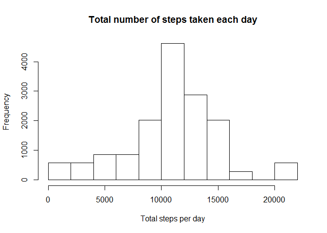

# Reproducible Research: Peer Assessment 1


## Libraries

```r
library(data.table)
```

```
## Warning: package 'data.table' was built under R version 3.1.2
```

```r
library(ggplot2)
library(plyr)
```
   
## Loading and preprocessing the data


```r
dt <- fread("activity.csv", colClasses = "character")

##Removing NA's
dtaux <- dt[!is.na(steps), ]

##Calculations per day and interval
dtaux[, totalstepsperday := sum(as.numeric(steps), na.rm = TRUE), by = date] #Total
dtaux[, meanstepsperinterval := mean(as.numeric(steps), na.rm = TRUE), by = interval] #Mean
```
   
##What is mean total number of steps taken per day? 

###1. Histogram of the total number of steps taken each day


```r
## histogram of the total number of steps taken each day
hist(dtaux[,totalstepsperday], main="Total number of steps taken each day", xlab="Total steps per day", ylab="Frequency")
```

 

###2. The mean and median total number of steps taken per day


```r
print(mean(dtaux[,totalstepsperday])) #Mean
```

```
## [1] 10766.19
```

```r
print(median(dtaux[,totalstepsperday])) #Median
```

```
## [1] 10765
```
   
##What is the average daily activity pattern?

###1. Plot Interval vs mean


```r
p <- ggplot(dtaux, aes(x=as.numeric(interval), y=meanstepsperinterval, group=1)) +
        geom_line() +
        labs(title = "Average number of steps taken across all days") +
        labs(x = "5-minute interval", y = "Average number of steps")
         
print(p)
```

 

###2. The 5-minute interval, on average across all the days in the dataset, that contains the maximum number of steps


```r
maxmeanvalue <- max(dtaux[,meanstepsperinterval])
print(dtaux[meanstepsperinterval==maxmeanvalue, interval][[1]])
```

```
## [1] "835"
```


   
## Imputing missing values

###1. Number of missing values in the dataset (i.e. the total number of rows with NAs)


```r
narows <- nrow(dt[!complete.cases(dt),])
```

The total number of rows with NAs is 2304

###2. Strategy for filling in all of the missing values  
Replace the NA's values with the mean by interval

###3. New dataset that is equal to the original dataset but with the missing data filled in.

```r
## Create a new dataset
newdt <- dt

##To numeric
newdt$steps <- as.numeric(newdt$steps) 

##Getting mean by interval (without NA)
newdt[, meanstepsperinterval := mean(steps, na.rm = TRUE), by = interval] #Mean

##Filling NA values with the mean of the interval
newdt[is.na(steps), steps := meanstepsperinterval]

##Calculate for the new dataset
newdt[, totalstepsperday := sum(steps), by = date] #Total
```

###4. Histogram of the total number of steps taken each day


```r
## histogram of the total number of steps taken each day
hist(newdt[,totalstepsperday], main="Total number of steps taken each day", xlab="Total steps per day", ylab="Frequency")
```

 

####4.1 The mean and median total number of steps taken per day

```r
meandifference <- mean(newdt[,totalstepsperday]) - mean(dtaux[,totalstepsperday]) #Mean
mediandifference <- median(newdt[,totalstepsperday]) - median(dtaux[,totalstepsperday]) #Median

print(mean(newdt[,totalstepsperday])) #Mean
```

```
## [1] 10766.19
```

```r
print(median(newdt[,totalstepsperday])) #Median
```

```
## [1] 10766.19
```

####4.2 Do these values differ from the estimates from the first part of the assignment? What is the impact of imputing missing data on the estimates of the total daily number of steps?

Difference between Mean: 0  
Difference between Median: 1.1886792  
  
There was an increase of the total on the histogram  
  
   
##Are there differences in activity patterns between weekdays and weekends?
###1. Create a new factor variable


```r
##I didn't do a factor, but I put the values directly
newdt[, datenumber := as.POSIXlt(as.Date(date))$wday ]
newdt[datenumber %in% c(6,0), dateaux := "weekend"]
newdt[datenumber %in% 1:5, dateaux := "weekday"]

##Getting new mean by interval in weekdays and weekends
newdt[dateaux == "weekend", meanstepsperinterval := mean(steps), by = interval] #Mean
newdt[dateaux == "weekday", meanstepsperinterval := mean(steps), by = interval] #Mean

##Filling NA values with the mean of the interval
newdt[is.na(steps), steps := meanstepsperinterval]


##Calculate total steps per day for the new dataset
newdt[, totalstepsperday := sum(steps), by = date] #Total
```

###2. Plot Interval vs mean (Weekdays and Weekends)


```r
p <- ggplot(newdt, aes(x=as.numeric(interval), y=meanstepsperinterval, group=1)) +
        geom_line() +
        labs(title = "Average number of steps taken across all days") +
        labs(x = "5-minute interval", y = "Average number of steps") +
        facet_grid(dateaux ~ .)
         
print(p)
```

 
